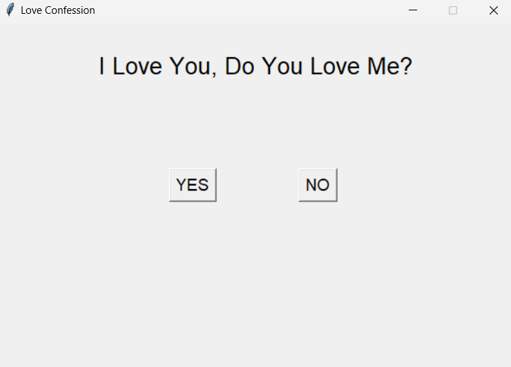

Project:

---

# Love Confession Game  

A playful and interactive tkinter app that lets you confess your love in a fun way! The "YES" button expresses mutual love, while the "NO" button hilariously avoids your click.  

## Features  
- **Interactive UI**: Respond to the question with "YES" or try catching the elusive "NO" button.  
- **Dynamic Behavior**: The "NO" button moves randomly when hovered over, making it impossible to click.  
  
## Preview  
  


## Prerequisites  
- Python 3  
- tkinter (comes pre-installed with Python on most platforms)  

## How to Run  
1. Clone this repository:  
   ```bash  
   git clone https://github.com/shahiirrrr/love-confession-game.git  
   ```  

2. Navigate to the project directory:  
   ```bash  
   cd love-confession-game 
   ```  

3. Run the script:  
   ```bash  
   python love_u.py  
   ```  

## How It Works  
1. Launch the app.  
2. Read the question: *"I Love You, Do You Love Me?"*  
3. Click "YES" to express your love.  
4. Try to click "NO" if you dare—it won't make it easy!  

## Code Highlights  
- **YES Button**: Displays a sweet message when clicked.  
- **NO Button**: Moves randomly within its frame whenever hovered over.  
- **tkinter**: Used to build the interactive GUI.  

## Contributing  
Feel free to fork this repo and contribute! Pull requests for bug fixes, new features, or enhancements are welcome.  

## License  
This project is licensed under the [MIT License](LICENSE).  

---